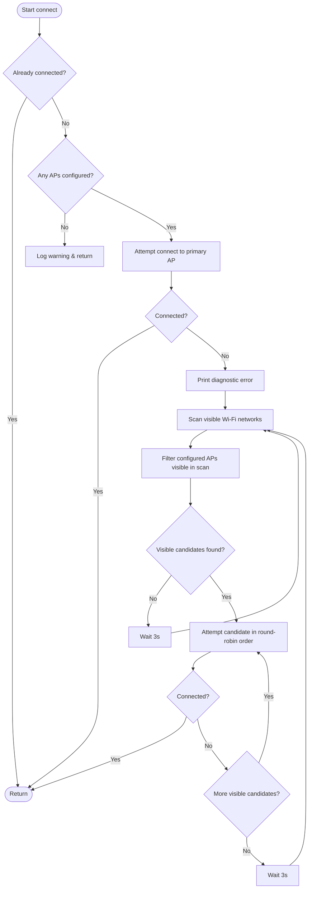

# Wi-Fi Manager Specification (`WifiManager`)

## 1. Overview & Motivation

In microcontroller environments running **CircuitPython** (such as Raspberry Pi Pico W / Pico 2 W and ESP32), device firmware often needs to operate across multiple physical Wi-Fi environments (e.g., home, office, mobile hotspot, lab network) without requiring code modifications or complex reconfiguration.

### The TOML Constraint in CircuitPython
Standard CircuitPython firmware includes only a minimal, lightweight C parser for `settings.toml` / simple TOML configurations rather than a full TOML parser (such as CPython's `tomllib`). As a result:
- Structured nested tables (e.g., `[[wifi]]` array of tables) are **not natively supported**.
- Configuration must use flat key-value pairs.

To support multiple Wi-Fi access points seamlessly while adhering to CircuitPython's flat configuration model, `WifiManager` standardizes on **indexed string keys** and implements an intelligent **scan-and-retry connection strategy**.

---

## 2. Configuration Format

Wi-Fi credentials are read from the project configuration dictionary (parsed from `config.toml` / `config-base.toml` or `settings.toml`).

### Key Naming Conventions
Up to **10 Access Point pairs** are supported, indexed from `0` to `9`:

| Index | SSID Key | Password Key | Notes |
| :--- | :--- | :--- | :--- |
| **0** (Primary) | `wifi_ssid` *(or `wifi_ssid0`)* | `wifi_password` *(or `wifi_password0`)* | Primary default AP attempted first |
| **1** | `wifi_ssid1` | `wifi_password1` | Fallback AP 1 |
| **2** | `wifi_ssid2` | `wifi_password2` | Fallback AP 2 |
| **...** | ... | ... | ... |
| **9** | `wifi_ssid9` | `wifi_password9` | Fallback AP 9 |

### Parsing Rules
1. **Index 0 Resolution**: `wifi_ssid` is checked first. If absent or empty, `wifi_ssid0` is checked.
2. **Indices 1 through 9**: Keys `wifi_ssid1`..`wifi_ssid9` and `wifi_password1`..`wifi_password9` are checked in numerical sequence.
3. **Empty String Handling**: Any entry where the SSID is omitted, empty, or whitespace-only is automatically skipped.
4. **Password Length**: Empty passwords (`""`) are valid for open networks.

### Example `config.toml`
```toml
hostname = "nscon"
tcp_port = 10100

# Primary AP (Home)
wifi_ssid = "HomeNetwork-2G"
wifi_password = "SecretPassword1"

# Fallback AP 1 (Mobile Hotspot)
wifi_ssid1 = "PhoneHotspot"
wifi_password1 = "HotspotPassword"

# Fallback AP 2 (Office / Lab)
wifi_ssid2 = "LabNetwork"
wifi_password2 = "LabPass123"
```

---

## 3. Connection Algorithm



### 1. Fast Direct First Attempt
* On startup (or reconnection), `WifiManager` **immediately attempts to connect to the primary AP** (index `0`) without scanning.
* *Rationale*: In the vast majority of boot cycles, the device resides in its primary home/lab network. Avoiding a Wi-Fi scan on the initial attempt saves 1.5–3 seconds of startup latency.

### 2. Diagnostic Scan on Failure
* If the primary AP connection fails, `WifiManager` maps the low-level failure code (ESP-IDF or CYW43 error) to a human-readable diagnosis and prints it.
* It then scans all visible 2.4 GHz Wi-Fi channels using `wifi.radio.start_scanning_networks()`, printing RSSI and channel diagnostics for troubleshooting.
* The scan resources are always freed within a `finally` block via `wifi.radio.stop_scanning_networks()`.

### 3. Scan-Filtered Round-Robin Fallback
* From the scan results, `WifiManager` filters the configured AP list to find only **visible SSIDs**.
* Non-visible configured networks are skipped, preventing costly 5–10 second connection timeouts on unavailable networks.
* Visible candidate APs are attempted in order starting immediately after the last attempted index (`(last_tried_idx + step) % num_aps`), ensuring fair round-robin rotation without starving any candidate.

### 4. Backoff & Re-Scan
* If none of the configured APs are visible in the scan, or if all visible candidates fail authentication/association, the manager pauses for 3 seconds before initiating a new scan cycle.
* The loop continues indefinitely until connection is established or the caller aborts.

---

## 4. Class Architecture & API

### Class Definition

```python
class WifiManager:
    def __init__(self, config: dict[str, str | int | bool]) -> None:
        """
        Initializes the manager and parses up to 10 AP pairs from config.
        """

    @property
    def configured_ssids(self) -> list[str]:
        """
        Returns a list of all non-empty configured SSID names (omits passwords for privacy).
        """

    def scan_networks(self) -> set[str]:
        """
        Scans visible Wi-Fi networks, logs RSSI/channel metrics, and returns a set of visible SSIDs.
        """

    def connect(self, led: StatusLed | None = None) -> None:
        """
        Connects to Wi-Fi using the direct-first and scan-and-retry strategy.
        Optionally drives a StatusLed into INITIALIZING state during connection.
        """
```

### Public API Contract

| Method / Property | Signature | Description |
| :--- | :--- | :--- |
| `__init__` | `(config: dict[str, Any]) -> None` | Extracts `wifi_ssid[0..9]` & `wifi_password[0..9]`, building `self.ap_list`. |
| `configured_ssids` | `-> list[str]` | Safe list of configured network names for logging/status display. |
| `scan_networks` | `-> set[str]` | Scans 2.4 GHz band, prints AP metrics, and returns unique visible SSIDs. |
| `connect` | `(led: StatusLed \| None = None) -> None` | Blocks until Wi-Fi connection is established, updating LED state if provided. |

---

## 5. Error Diagnostics & Hardware Support

### Disconnect Code Mapping
`WifiManager` translates common CYW43 and ESP-IDF Wi-Fi error codes into actionable diagnostic messages:

| Error Code | Meaning | Diagnostic Advice |
| :--- | :--- | :--- |
| `2` | `Auth expired` | Check 2.4 GHz band compatibility, AP signal strength, or AP MAC filtering. |
| `5` | `Assoc too many` | Access Point has reached max connected client capacity. |
| `15` / `204` | `Handshake timeout` | Incorrect Wi-Fi password or weak signal. |
| `201` | `No AP found` | SSID not found or broadcasting only on 5 GHz band. |
| `202` | `Auth failed` | Password authentication rejected by AP. |

### Hardware & Platform Compatibility
- **Raspberry Pi Pico W / Pico 2 W**: Fully compatible with Infineon CYW43439 radio driver in CircuitPython 9.x / 10.x.
- **ESP32 / ESP32-S2 / ESP32-S3 / ESP32-C3**: Fully compatible with native ESP-IDF Wi-Fi stack.
